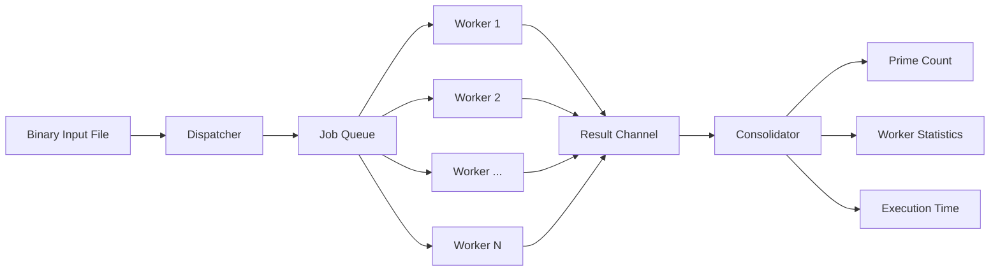
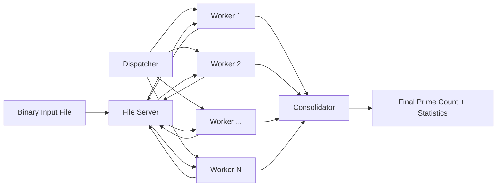

# ⚙️ Distributed Prime Counter in Go

### Concurrent and Distributed Processing with Goroutines, Worker Pools & gRPC

A systems-programming project that explores how a CPU- and I/O-intensive workload can be scaled from **single-machine concurrency** to a **distributed multi-process architecture**.

The system processes large binary files containing `uint64` values and counts how many values are prime.

Two implementations are included:

1. **Concurrent Prime Counter** — uses Go goroutines and worker-pool patterns on a single machine.
2. **Distributed Prime Counter** — separates the workload across independent services communicating through gRPC and Protocol Buffers.

The project was developed as part of an **Advanced Operating Systems** course and focuses on concurrency, synchronization, workload distribution, binary I/O, inter-process communication, and performance analysis.

---

## 🚀 What I Built

### Project 1 — Concurrent Processing

A single-machine implementation that uses:

* Go goroutines
* Worker pools
* Producer-consumer processing
* Channels
* Mutexes
* WaitGroups
* Chunked binary-file reads
* Work segmentation
* Parallel prime testing
* Worker-load statistics

### Project 2 — Distributed Processing

A distributed implementation that extends the same workload across independently running services using:

* gRPC
* Protocol Buffers
* Dispatcher service
* File server
* Multiple worker processes
* Consolidator
* Configurable worker counts
* Configurable segment/chunk sizes
* Shell-based service orchestration

---

# 🏗️ Architecture

## Concurrent Implementation



The dispatcher divides the input file into independent segments. Worker goroutines process those segments concurrently and return partial counts to the consolidator.

---

## Distributed Implementation



The distributed version separates responsibilities across independently running components.

---

# 🧩 Distributed Components

## Dispatcher

The dispatcher divides the input workload into segments and distributes jobs to workers.

Each job identifies the portion of the binary file that needs to be processed.

---

## File Server

The file server owns access to the binary input file.

Workers request the required data over gRPC rather than opening the source file independently.

---

## Workers

Workers:

1. Request jobs from the dispatcher.
2. Fetch the corresponding binary data.
3. Decode `uint64` values.
4. Test each value for primality.
5. Return partial counts and job-completion information.

The number of workers can be configured when launching the system.

---

## Consolidator

The consolidator aggregates results returned by the workers.

It reports:

* Total number of primes
* Minimum jobs completed by a worker
* Maximum jobs completed by a worker
* Average jobs per worker
* Median jobs per worker
* Total elapsed time

---

# 🔄 From Concurrency to Distribution

The two implementations demonstrate the progression from local parallelism to distributed execution.

| Concept           | Project 1                  | Project 2                    |
| ----------------- | -------------------------- | ---------------------------- |
| Execution         | Single process / machine   | Multiple processes/services  |
| Workers           | Goroutines                 | Independent worker processes |
| Communication     | Go channels                | gRPC                         |
| Data access       | Local file reads           | File-server RPC              |
| Serialization     | In-process values          | Protocol Buffers             |
| Coordination      | Channels / synchronization | Network services             |
| Scaling dimension | CPU concurrency            | Distributed workers          |

---

# 🛠️ Tech Stack

**Language**

`Go`

**Concurrency**

`Goroutines` · `Channels` · `Mutexes` · `WaitGroups`

**Distributed Systems**

`gRPC` · `Protocol Buffers` · `RPC`

**Systems Concepts**

`Worker Pool` · `Producer-Consumer` · `Synchronization` · `Load Distribution`

**I/O**

`Binary Files` · `Chunked Reads` · `uint64`

**Orchestration**

`Bash`

---

# 📁 Repository Structure

```text
distributed-prime-counter-go/
│
├── Project1/
│   ├── main.go
│   ├── go.mod
│   ├── README.md
│   ├── Project_Report.pdf
│   └── sample_output.txt
│
├── Project2/
│   ├── fileserver/
│   ├── pb/
│   ├── worker/
│   ├── main.go
│   ├── primes.proto
│   ├── primes_config.txt
│   ├── run.sh
│   ├── go.mod
│   ├── go.sum
│   ├── README.md
│   ├── Project2_Report.pdf
│   └── sample_output.txt
│
├── .gitignore
└── README.md
```

---

# ▶️ Project 1 — Concurrent Prime Counter

## Parameters

The concurrent implementation accepts:

```text
M = number of workers
N = segment size in bytes
C = chunk size in bytes
```

Defaults:

```text
M = 1
N = 65536
C = 1024
```

---

## Run

From the repository root:

```bash
cd Project1
```

Then:

```bash
go run main.go <datafile.dat>
```

or:

```bash
go run main.go <datafile.dat> <M> <N> <C>
```

Example:

```bash
go run main.go data1gb.dat 8 65536 4096
```

---

# ▶️ Project 2 — Distributed Prime Counter

Move into the distributed project:

```bash
cd Project2
```

## Build

Build the dispatcher/consolidator process:

```bash
go build -o main_bin .
```

Build the file server:

```bash
go build -o fileserver_bin ./fileserver
```

Build the worker:

```bash
go build -o worker_bin ./worker
```

---

## Configuration

`primes_config.txt` defines the service locations.

Example:

```text
dispatcher   localhost 5001
consolidator localhost 5002
fileserver   localhost 5003
```

Because the components communicate through gRPC, these endpoints can be adjusted for different process or host configurations.

---

## Generate Test Data

For a small local test file:

```bash
head -c 1M /dev/urandom > test.dat
```

For a larger workload:

```bash
head -c 1G /dev/urandom > data1gb.dat
```

Generated `.dat` files are excluded from Git.

---

## Run the Distributed System

The orchestration script accepts:

```text
./run.sh <N> <C> <M> <DATA> <CONFIG>
```

where:

```text
N      = segment size
C      = chunk size
M      = number of workers
DATA   = binary input file
CONFIG = service configuration file
```

Example with 16 workers:

```bash
./run.sh 65536 4096 16 data1gb.dat primes_config.txt
```

The script starts:

```text
File Server
    ↓
Dispatcher + Consolidator
    ↓
Worker Processes
```

and waits for the complete workload to finish.

---

# 📊 Performance Instrumentation

Both implementations report execution and workload-distribution information.

Example metrics include:

```text
Total primes
Elapsed time
Minimum jobs per worker
Maximum jobs per worker
Average jobs per worker
Median jobs per worker
```

Sample output from recorded runs is available at:

* [`Project1/sample_output.txt`](Project1/sample_output.txt)
* [`Project2/sample_output.txt`](Project2/sample_output.txt)

These sample executions demonstrate the instrumentation built into each implementation.

Because the stored runs use independently generated binary files and different execution parameters, they should be treated as **examples rather than a controlled performance comparison**.

---

# ⚡ Performance Tuning

Several parameters influence system behavior.

## Worker Count (`M`)

Increasing the number of workers can increase parallelism, but too many workers may introduce:

* scheduling overhead
* synchronization costs
* network/RPC overhead
* I/O contention

---

## Segment Size (`N`)

The segment size controls how much work is assigned per job.

Smaller segments can improve load balancing but increase scheduling and communication overhead.

Larger segments reduce coordination overhead but can make work distribution less balanced.

---

## Chunk Size (`C`)

Chunk size affects how binary data are read and processed.

Larger chunks can reduce the number of I/O operations, while excessively large chunks may increase memory pressure.

---

# 🎯 Engineering Concepts Demonstrated

This project explores practical implementations of:

* Concurrent programming
* Producer-consumer architectures
* Worker pools
* Synchronization
* Work partitioning
* Load balancing
* Binary file processing
* Performance measurement
* RPC design
* Protocol serialization
* Distributed service coordination
* gRPC communication
* Process orchestration

---

# 📄 Project Reports

More detailed implementation and experimental documentation is available in:

* [`Project1/Project_Report.pdf`](Project1/Project_Report.pdf)
* [`Project2/Project2_Report.pdf`](Project2/Project2_Report.pdf)

---

# ⚠️ Scope & Limitations

This project is primarily an operating-systems and distributed-systems experiment.

Current limitations include:

* No automatic service discovery
* No distributed deployment tooling
* No worker-failure recovery
* No persistent job queue
* No authentication between services
* No TLS configuration
* Shell-based local orchestration
* Performance depends heavily on workload, hardware, I/O characteristics, and configuration

The implementation is intended to explore systems concepts rather than provide a production distributed-compute framework.

---

# 🔮 Possible Extensions

Potential improvements include:

* Worker health checks
* Retry and failure-recovery logic
* Dynamic worker registration
* Containerized deployment
* Docker Compose orchestration
* Distributed deployment across multiple hosts
* Structured observability and metrics
* Benchmark automation
* Automated performance plots
* Controlled sequential-vs-concurrent-vs-distributed benchmarks

---

# 🎓 Project Context

Developed as part of an **Advanced Operating Systems** course.

The project was designed to explore how the same computational workload changes when moving from:

```text
Sequential thinking
        ↓
Concurrent processing
        ↓
Distributed processing
```

and to examine the engineering tradeoffs introduced by each architecture.

---

## 👩‍💻 Author

**Garvita Jain**

M.S. Computer Science — University of Maryland, Baltimore County

[GitHub](https://github.com/Gravity-2010) · [LinkedIn](https://www.linkedin.com/in/garvitajain-605a89160/)
